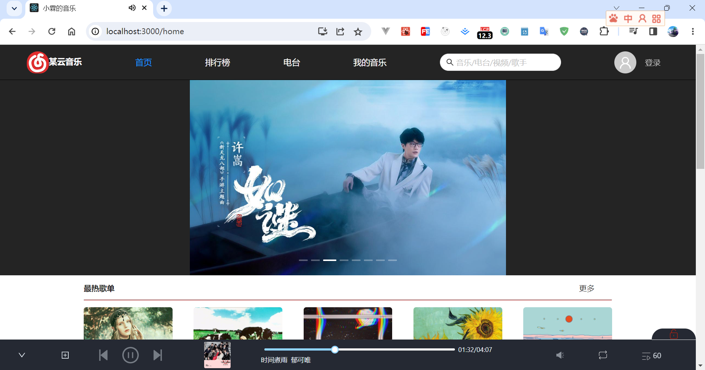
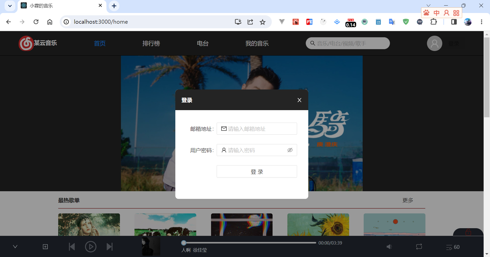
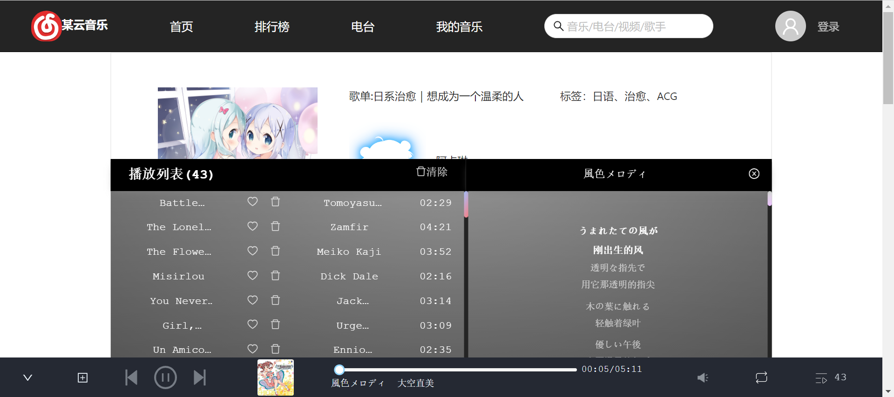
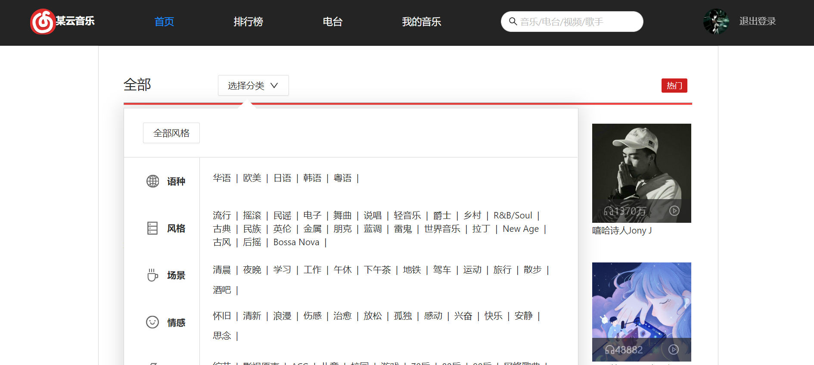
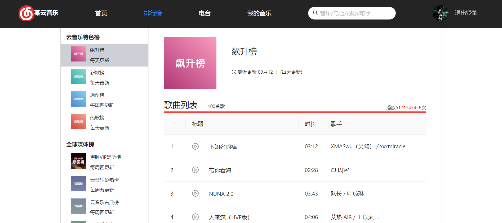
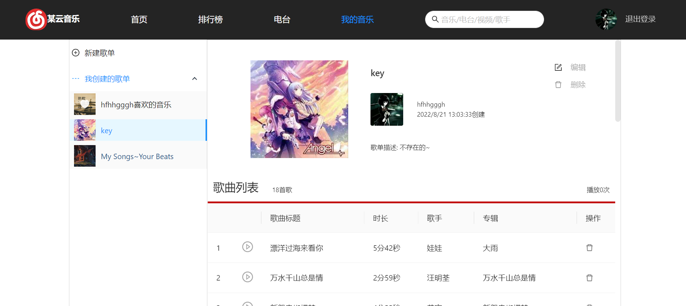

# 这是一个仿网易云的网站
## 介绍
防网易云音乐网页版(简易版本)，有很多地方省略了，样式使用scss，组件库使用antd，样式大多是自己设计  
整体架构参考网易云音乐
登录使用邮箱登录 
后端数据采用 [NeteaseCloudMusicApi](https://github.com/Binaryify/NeteaseCloudMusicApi) 提供的服务。
项目开始时间:2022-08-03至2022-09-01
项目完善时间:2023-02-05至2023-02-10
***
## 启动
yarn start(yarn run start)
## 使用的库
- js-cookie
- axios
- react-dom
- mobx
- mobx-react
- dayjs
- pubsub-js(消息订阅与发布)
- scss
- 其他react模板自带的库
## 功能特性
1. 底部播放器组件
2. 全屏歌词滚动
3. 图片路由懒加载
4. 文字展开收起
5. 多行文字省略
## 项目部分截图

