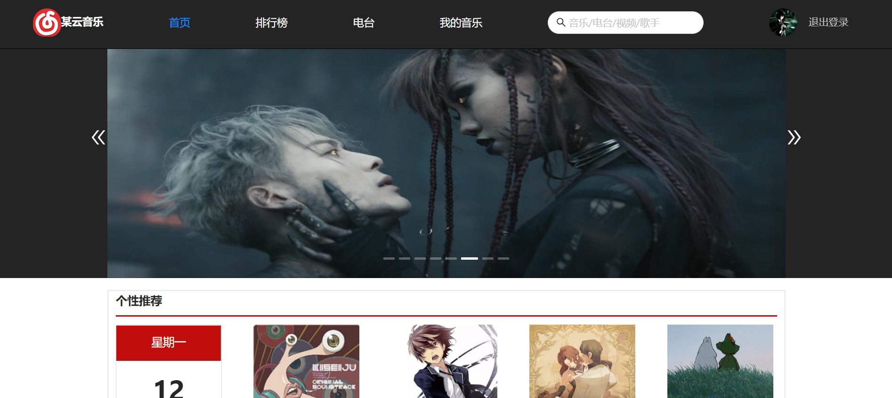
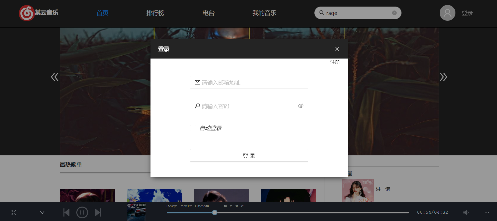
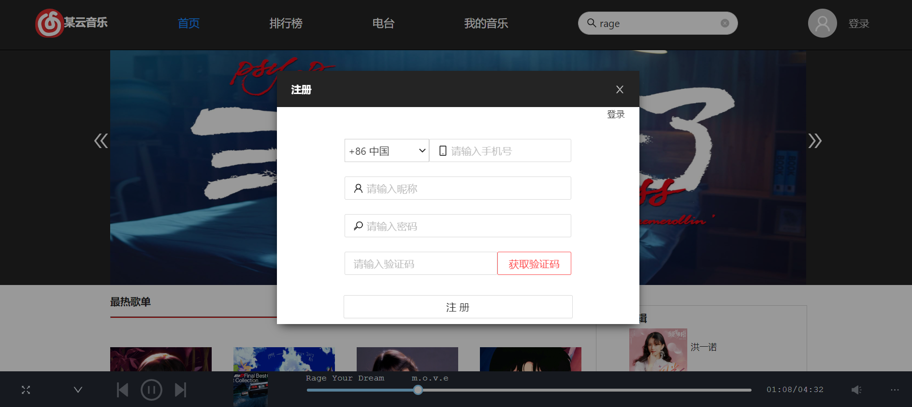
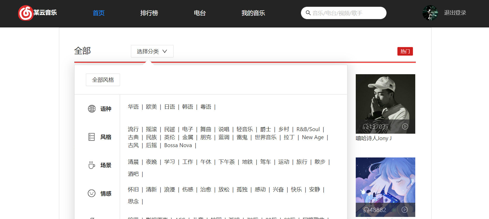
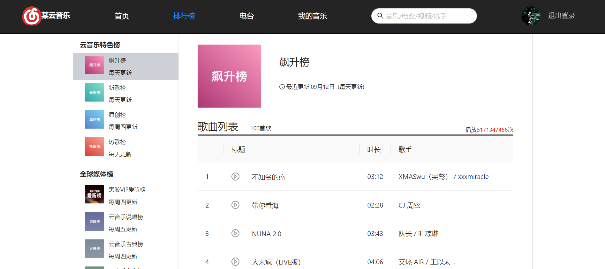
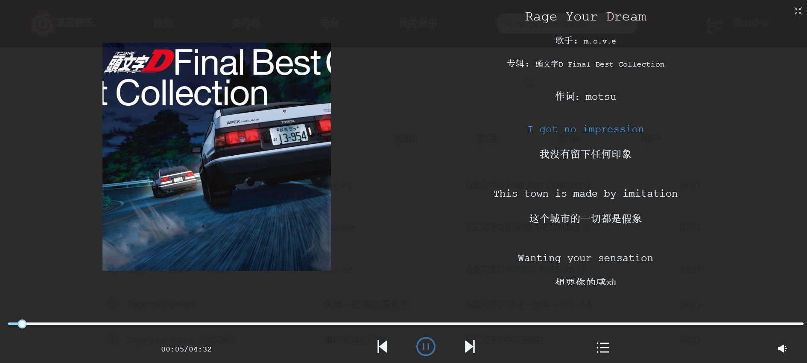
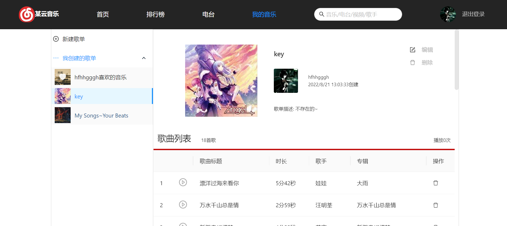
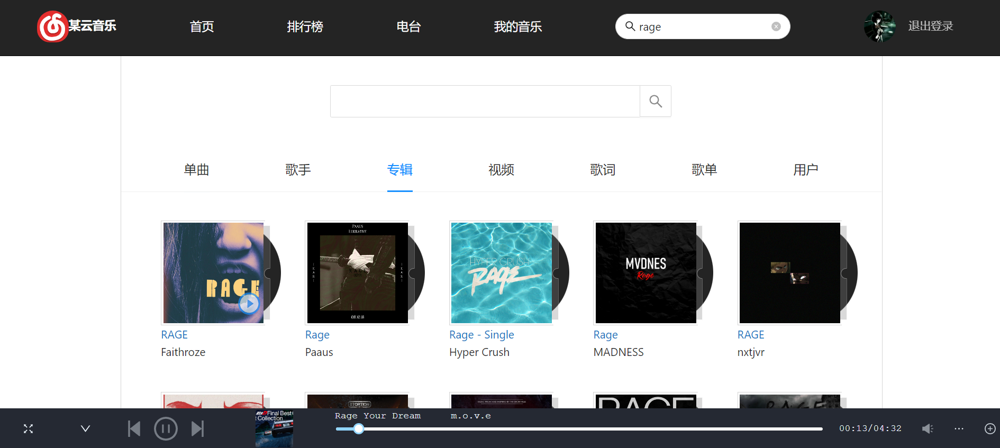

# 这是一个仿网易云的网站
防网易云音乐网页版(简易版本)，有很多地方省略了，样式使用scss，组件库使用antd，样式大多是自己设计  
整体架构参考网易云音乐(目前登录只能邮箱登录，手机登录好像不支持)  
后端数据采用 [NeteaseCloudMusicApi](https://github.com/Binaryify/NeteaseCloudMusicApi) 提供的服务。该项目是本人大二暑假刚学完react+学了一些ts后开始写的，代码可能很冗余而且ts的用法不够规范，本人菜狗一个，该项目也有许多不足，后面继续补充完善。。。
***
## 启动
yarn start(yarn run start)
## 使用的库
- js-cookie
- axios
- react-dom
- mobx(集中式状态管理)
- dayjs
- pubsub-js(消息订阅与发布)
- scss
- 其他react模板自带的库
## 功能特性
1. 底部播放器组件
2. 全屏歌词滚动
3. 图片路由懒加载(只应用到了更多歌单)
4. 文字展开收起(只应用到了歌单介绍)
## 项目部分截图
首页

***
登录

注册

***
歌单分类

***
排行榜

***
全屏

***
我的音乐

***
搜索

## 总结
之后可能会重构一次项目，会增加的技术，自定义hook(减少代码冗余，利于模块化，利于维护),页面优化等，要增加的部分之后再说吧。。。

